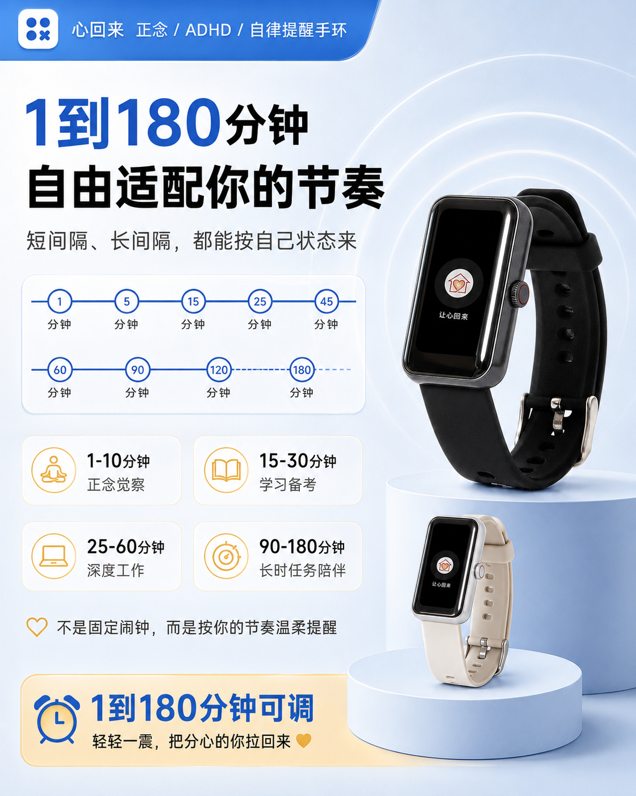

# 心回来 (Xinhuilai) · iOS CoreBluetooth SDK

<div align="center">
  
  <h3>觉见科技 (Awansight) 官方 iOS BLE 蓝牙接入套件</h3>
  <p><b>广州觉见科技有限公司 (Guangzhou Juejian Technology Co., Ltd.)</b></p>
  <p>
    <a href="https://www.awansight.com">官方旗舰网站</a> •
    <a href="https://www.awansight.com/xinhuilai/">手环使用说明</a> •
    <a href="https://github.com/sinianchu9/xinhuilai-Android">Android 客户端</a> •
    <a href="https://github.com/sinianchu9/WeChat_Mini_Program_Ble_SDK">微信小程序 SDK</a>
  </p>
  <p>
    
    
    
    
  </p>
</div>

---

## 1. 框架概述

`xinhuilai_ios` 是广州觉见科技有限公司为「心回来」智能提醒手环深度定制的 iOS 端底层通信 SDK。基于原生 Apple **CoreBluetooth** 框架构建，专为低功耗、高可靠的专注自律硬件交互设计。

### 核心亮点
- **极简配对**：秒级 BLE 广播扫描过滤与自动重连机制。
- **节律配置**：支持 1~180 分钟精准循环提醒周期与 5 种体感震动模式指令封装。
- **离线自主运行保障**：指令一次写入手环芯片，手机休眠或断开后手环精准按时震动。
- **全量健康遥测解析**：包含心率、血氧饱和度、体表温度、科学睡眠分期与计步数据流解码。
- **后台保活机制**：支持 iOS `bluetooth-central` 模式，后台静默同步日常体征。

<div align="center">
  
  
</div>

---

## 2. 快速接入示例 (Swift)

### 2.1 初始化与设备发现
```swift
import CoreBluetooth
import XinhuilaiBleKit

class BraceletManager: NSObject, CBCentralManagerDelegate {
    var centralManager: CBCentralManager!
    
    override init() {
        super.init()
        centralManager = CBCentralManager(delegate: self, queue: nil)
    }
    
    func centralManagerDidUpdateState(_ central: CBCentralManager) {
        if central.state == .poweredOn {
            // 扫描心回来设备广播服务
            centralManager.scanForPeripherals(withServices: [XHLBleConstants.serviceUUID], options: nil)
        }
    }
}
```

### 2.2 下发专注提醒节律
```swift
// 配置 25 分钟番茄专注节律 + 单次柔和震动
let config = XHLReminderConfig(
    intervalMinutes: 25,
    vibrationPattern: .singleSoft, // 五种模式之一
    startHour: 8,
    endHour: 22
)

XHLBleClient.shared.applyFocusRhythm(config) { success, error in
    if success {
        print("心回来手环提醒规则下发成功，已进入离线自主执行模式")
    }
}
```

---

## 3. 五种物理震动模式说明

| 模式枚举 | 震动特征 | 推荐应用场景 |
| :--- | :--- | :--- |
| `.singleSoft` | 单次轻触柔和震动 | 静音阅读、图书馆专注、轻度防走神 |
| `.singleStrong` | 单次干脆增强震动 | 备考刷题、开会提神 |
| `.doubleSoft` | 双次连续轻柔触感 | 番茄工作法阶段切换 |
| `.softAndStrong` | 一柔一强复合节律 | 正念呼吸训练、深度冥想锚点 |
| `.doubleStrong` | 双次高频强劲提醒 | ADHD 冲动行为阻断、重度发呆打断 |

---

## 4. 商业合作与知识产权

- **官方网站**：[https://www.awansight.com](https://www.awansight.com)
- **手环在线说明书**：[https://www.awansight.com/xinhuilai/](https://www.awansight.com/xinhuilai/)
- **主办单位**：广州觉见科技有限公司 (Guangzhou Juejian Technology Co., Ltd.)
- **资质证书**：国家知识产权局第 **88823416** 号「心回来」商标注册证 | 粤ICP备2025430838号-2

Copyright (c) 2026 **广州觉见科技有限公司** All rights reserved.
