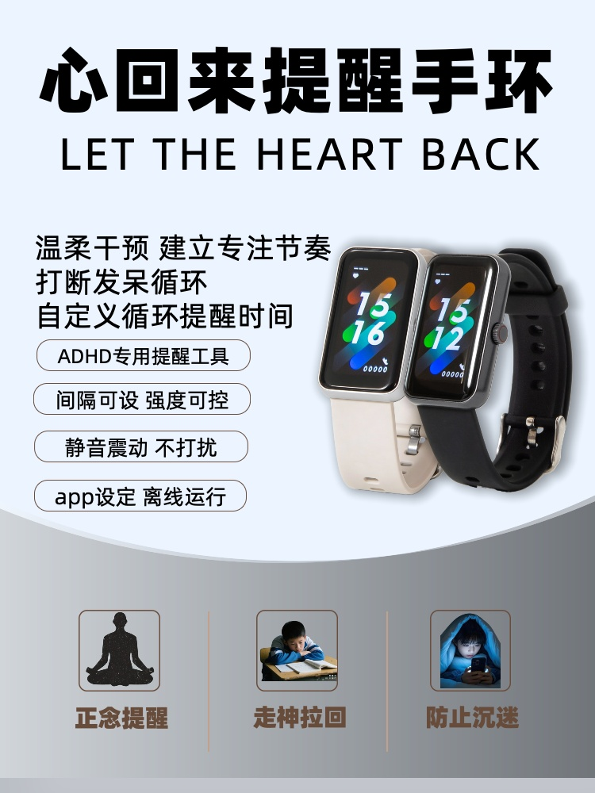

# Xinhuilai · iOS CoreBluetooth SDK

  
  <h3>Official iOS BLE SDK for Mindful Focus & Biometrics</h3>
  
<b>Guangzhou Juejian Technology Co., Ltd. (Awansight)</b>

  

    <a href="https://www.awansight.com">Official Website</a> •
    <a href="https://www.awansight.com/xinhuilai/">User Manual</a> •
    <a href="https://github.com/sinianchu9/xinhuilai-Android">Android Client</a> •
    <a href="https://github.com/sinianchu9/WeChat_Mini_Program_Ble_SDK">WeChat Mini Program SDK</a>
  

---

## Overview

`xinhuilai_ios` is the official iOS CoreBluetooth SDK developed by **Guangzhou Juejian Technology Co., Ltd.** for the **Xinhuilai** smart focus & self-discipline bracelet.

Designed with an **Offline-First** philosophy: once paired and configured, the bracelet operates completely standalone without maintaining continuous Bluetooth or Wi-Fi connectivity, delivering silent haptic cues directly to the user's wrist.

## Key Features
- **Flexible Rhythms**: Configure 1 to 180 minute recurring focus intervals.
- **5 Silent Haptic Modes**: Single Soft, Single Strong, Double Soft, Soft+Strong, Double Strong.
- **Complete Biometrics Parsing**: Decodes real-time and cached PPG heart rate, SpO2, skin temperature, sleep stages, and pedometer steps.
- **Background Keep-Alive**: Supports iOS background execution modes for seamless biometrics synchronization.

## Compliance & Intellectual Property
- **Entity**: Guangzhou Juejian Technology Co., Ltd.
- **Trademark**: Approved Trademark No. **88823416** (心回来 / Xinhuilai).
- **Domain**: [https://www.awansight.com](https://www.awansight.com)

Copyright (c) 2026 **Guangzhou Juejian Technology Co., Ltd.** All rights reserved.
